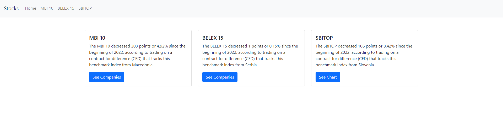
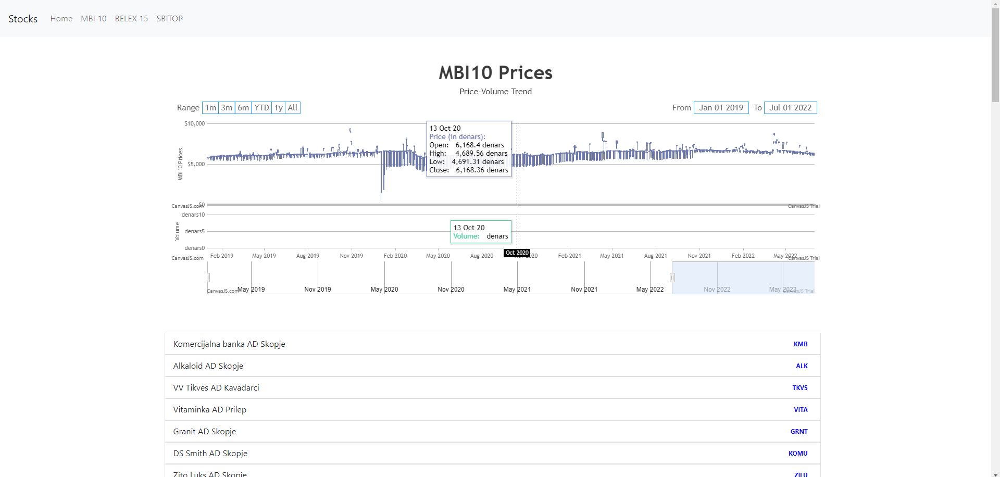
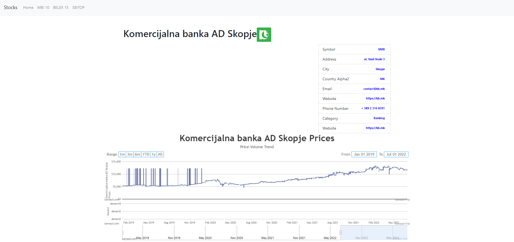

# Stock Exchange App - Macedonia, Serbia, and Slovenia





## Introduction

This is a ReactJS-based front-end application for the stock exchange, focusing on the markets in Macedonia, Serbia, and Slovenia. The app provides users with real-time stock data, allowing them to view stock prices, historical charts, and make informed investment decisions.

## Features

- Real-time stock data from the stock exchanges in Macedonia, Serbia, and Slovenia.
- Interactive charts for historical stock price analysis.
- User-friendly interface for ease of use.
- Responsive design for optimal viewing on various devices.

## Installation

Before running the application, ensure you have the following prerequisites:

- Node.js and npm installed on your machine.

Follow these steps to run the application:

1. Clone the repository to your local machine.

```bash
git clone https://github.com/simeonmarkoski/macedonian-stock-exchange-front-end.git
```

2. Navigate to the project directory.

```bash
cd stock-exchange-app
```

3. Install the project dependencies.

```bash
npm install
```

4. Start the development server.

```bash
npm start
```

5. Open your browser and go to http://localhost:4000 to view the app.

## Contributing

Contributions to the project are welcome. If you find any bugs or have suggestions for improvements, please feel free to open an issue or submit a pull request.

## License

This project is licensed under the <u><b>MIT License</b></u>.